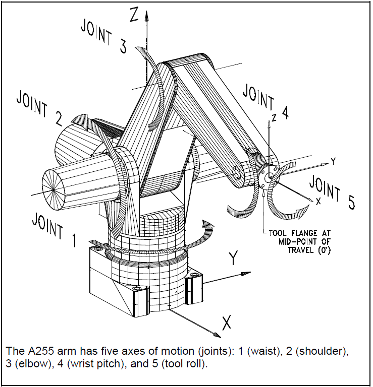
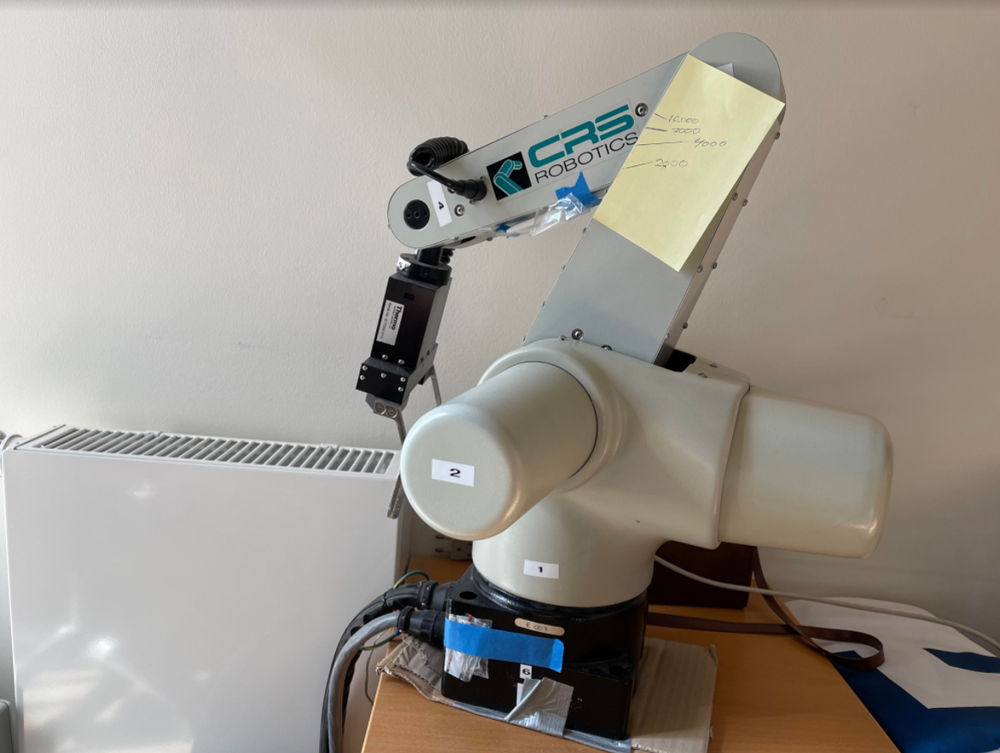

# CRS A255 controller

## This is my Covid-19 lock-down project:  Building a motion and motor controller for a 5-axis industrial robot.

Why?  Well, why not?  I had a CRS A255 robot arm for some years and always wanted more flexibility in the controller and it’s a good challenge to design everything from scratch.

The A255 is a 5-axis articulated industrial robot arm created by  CRS Robotics. 

| Technical Specifications of arm:|
|----------------------------------|
|Number of axes 5  
|              Weight 17 kg [37 lb]  |
|    Mounting Upright or inverted  |
|  Nominal payload 1 kg [2.2 lb]  |
|Reach 559 mm [22 in.]  |
|(joint 1 axis to tool flange)  |
|Repeatability ± 0.05 mm [0.002 in.]  
|Drive system Electromechanical motors  
|Incremental encoders in each joint  
|Transmission Harmonic drives  
|Brakes Brakes on joints 2, 3, 4, and 5  
|End-of-arm connections Servo gripper connector on wrist  
|Air connector on wrist  

This is mine in my home office. The Post It note on the side is there for checking the encoder position. Low tech, but good enough for quick testing. It shows me the encoder positions 2000, 4000, 7000 and 10.000 for this axis. 

