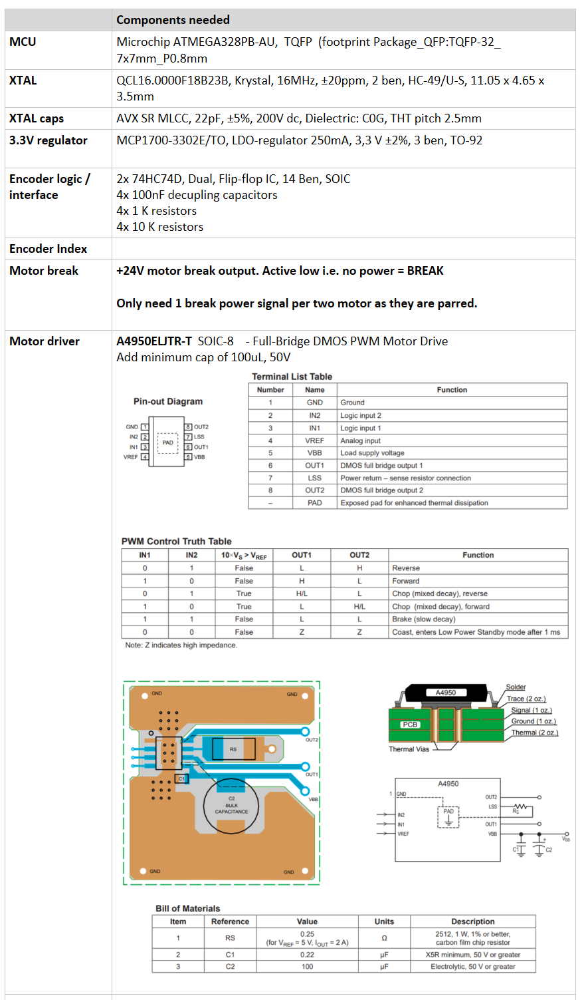
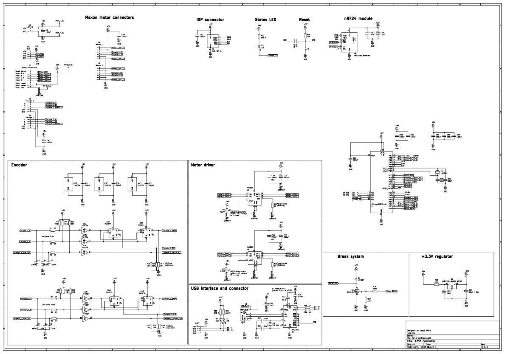

 
# CRS A255 controller
   
## This is my Covid-19 lock-down project:  Building a motor controller for a 5-axis industrial robot.

Why?  Well, why not?  I had a CRS A255 robot arm for some years and always wanted more flexibility in the controller and it’s a good challenge to design everything from scratch.  It's Christmas 2020 and we cannot visit the family or go anywhere due to Covid, so time to spend the holidays on something interesting. 

## Project tasks:
- [x] Hardware design for a multi-axis motor controller.  [link](#head_Hardware) 
- [x] Design and produce the PCB.
- [ ] Design a communication protocol and command set. In progress.  
- [ ] Write the firmware.  In progress.
- [ ] Software a PC-based control software with UI.  Only for debugging right now. 

Go to [The build log](#head_BuildLog) for details and the currect status.

------------------------

The A255 is a 5-axis articulated industrial robot arm created by  CRS Robotics. 

| Technical Specifications of arm:|
|----------------------------------|
|Number of axes 5  
|              Weight 17 kg [37 lb]  |
|    Mounting Upright or inverted  |
|  Nominal payload 1 kg [2.2 lb]  |
|Reach 559 mm [22 in.]  |
|(joint 1 axis to tool flange)  |
|Repeatability ± 0.05 mm [0.002 in.]  
|Drive system Electromechanical motors  
|Incremental encoders in each joint  
|Transmission Harmonic drives  
|Brakes Brakes on joints 2, 3, 4, and 5  
|End-of-arm connections Servo gripper connector on wrist  
|Air connector on wrist  

This is mine in my home office. The Post It note on the side is there for checking the encoder position. Low tech, but good enough for quick testing. It shows me the encoder positions 2000, 4000, 7000 and 10.000 for this axis. 

------------------------------------------------
## <a name="head_Hardware"> Hardware

### The Microcontroller:
At first, I wanted to use an ARM Cortex M4 from IT as this has build-in FPU, is 32 bit and extremely fast! I have pretty good experience with this and already have a VM setup with Keil compiler and debugger. I even created my own RTOS on this in the past, so it would have been perfect for this!   ...but I actually ended up going in a completely different direction and instead use an 8-bit, 16MHz AVR instead. 

Why AVR?  Lots of good reasons:
* I already had a good handful of AVRs left from another project.
* It is easier to solder by hand as it is only TQPF-32 and not LQFP-64 with a 0.5 pitch.
* Cost of chip. I can get 5 AVRs for the price of one ARM
* As the AVR is not fast enough to handle 5-axis with fast encoder feedback simultaneously, I want to create the hardware as a multi-core distributed system where one AVR only handles two axis.
  
  
 So, this means that the system architecture will be something like this:  

  
  
  Alle 3 blocks will use identical PCBs with each their own microcontroller (ATmega328PB) and dual DC motor driver. The Master will keep the communication with the PC via USB and command the two slaves using a bidirectional communication over I2C.   
  
  
    
  
  
Each PCB will implement the following functions. Only the Master needs the components mounted for the USB communication, but to save cost and not having to deal with two boards, the boards we be the same and I will just skip mounting all components on the Slaves. 
  
<a href="#top">Back to top of page</a>  
  
  
## <a name="head_BuildLog"> The build log:
  
### December 25th 2020:  
  
  Decided on the hardware components needed and create a list with notes.  
  
    
  
### December 26th 2020:  
  Assigning MCU pins.  The Arduino Nano is using the ATmega328P, but I will use the ATmega328PB as this is a newer chip with more I/O and functionality. It also means that it cannot use the Arduino bootloader, but as I will write all the code optimized for speed I guess I will not need the bootloader anyway.  We'll see when I get to the firmware at some point.
  
    
  
  Added I/O for SPI as I think this motor controller could become handy for other uses and hey, I love to have the option for wireless data. Therefore I added the SPI and control lines for a nRF24 module.
  
  
  ### December 29th 2020:  
The schematic is coming along well and I reuse parts from one of my older projects to speed up the process.
 
    
  
  You and see the schematic here: <a href="https://github.com/HaldInc/CRS-A255-controller/blob/main/A255%20controller%20schematic_ver1.pdf" target="_blank">PDF.</a>
  
  
 <a href="#top">Back to top of page</a>
  
  
  
